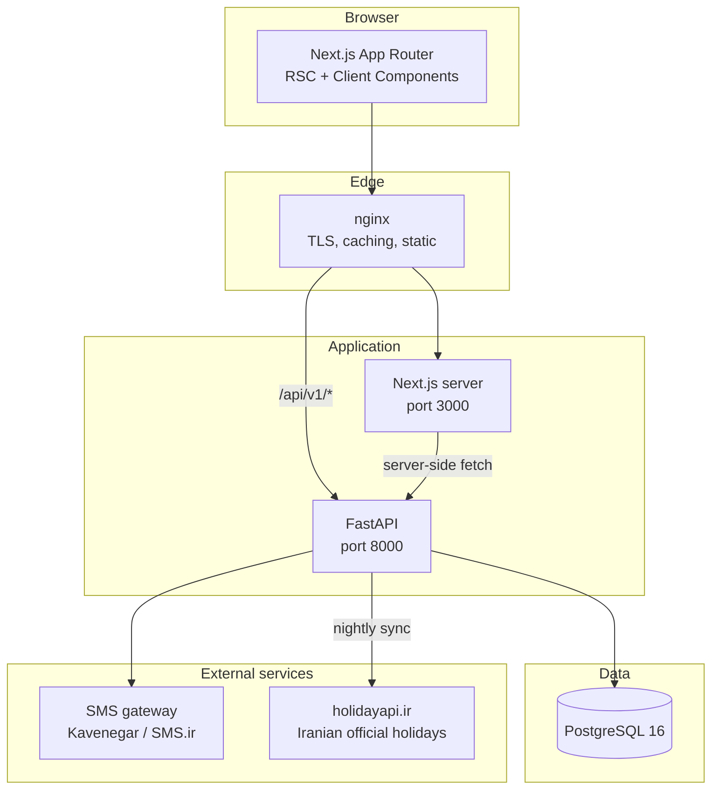
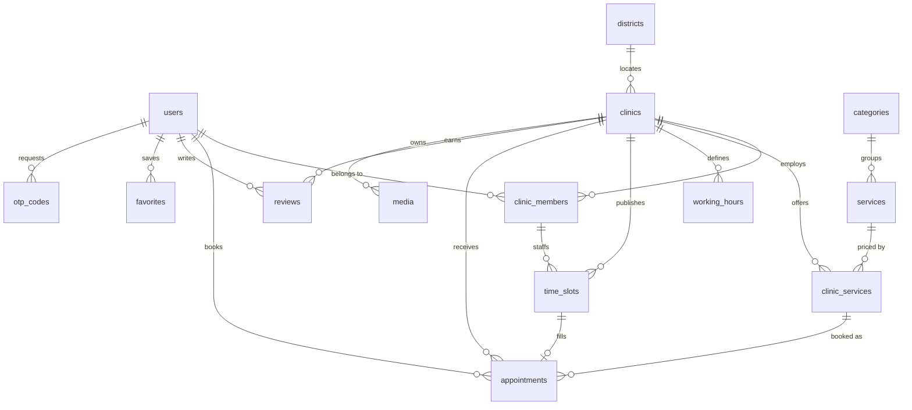
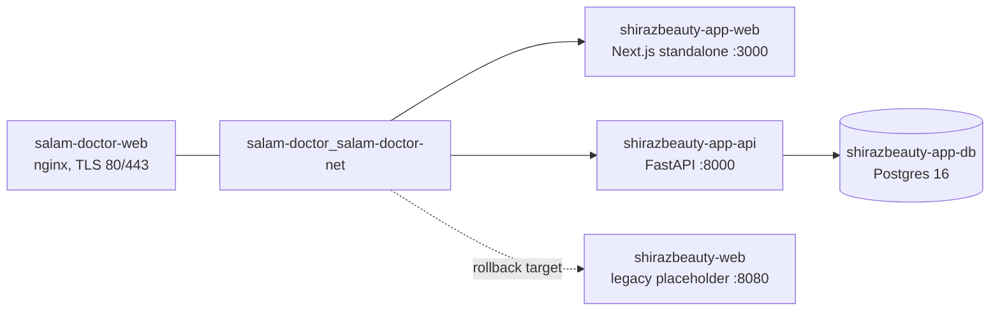

# Shiraz Beauty — Master Plan

**پلتفرم جامع دایرکتوری و رزرو نوبت کلینیک‌های زیبایی، پوست و مو در شیراز**

Version 0.1 · Phase 1 (Foundation) complete

---

## 1. Product vision and scope

Shiraz Beauty (`shirazbeauty.ir`) is a city-scoped, premium directory and booking
platform for the beauty industry in Shiraz: dermatology clinics, laser and
injection centres, hair-transplant clinics, and specialised salons.

The platform serves three audiences:

| Audience | Core need | Value delivered |
| --- | --- | --- |
| Client (مراجع) | Find a trustworthy specialist nearby and book without phone calls | Filtered search, transparent pricing, verified reviews, instant Jalali booking |
| Clinic / Specialist | Fill empty slots and reduce no-shows | Own profile page, slot management, service catalogue, daily client list, analytics |
| Platform admin | Keep the directory credible | Clinic verification workflow, content moderation, global settings |

Non-goals for v1: multi-city expansion, in-app payments (deposits arrive in a
later phase), native mobile apps, and telemedicine consultations.

### Design principles

- **Trust first, luxury throughout.** Crisp white surfaces, very light
  gray-blue panels, an elegant azure accent. Cool-toned shadows only — no
  muddy greys, no neon SaaS blue.
- **Persian-first.** Every layout is authored RTL-first with logical CSS
  properties; Persian digits in all user-facing numbers; Vazirmatn throughout.
- **Speed as a feature.** Server components by default, static marketing pages,
  self-hosted fonts (no foreign CDN dependency from inside Iran).

---

## 2. Tech stack

| Layer | Choice | Notes |
| --- | --- | --- |
| Frontend | Next.js 16 (App Router, TypeScript, React 19) | RSC-first, static marketing routes |
| Styling | Tailwind CSS 3.4 + `tailwind.config.ts` | HSL CSS variables, shadcn-compatible token contract |
| Components | shadcn-style primitives on Radix UI + `cva` | Hand-authored under `src/components/ui` |
| Icons | lucide-react | |
| Fonts | Vazirmatn RD variable, self-hosted via `next/font/local` | |
| Backend | Python 3.12 + FastAPI | async, OpenAPI docs at `/docs` |
| ORM / migrations | SQLAlchemy 2.0 (async, `asyncpg`) + Alembic | |
| Database | PostgreSQL 16 | |
| Auth | Mobile OTP → JWT (access + rotating refresh) | `python-jose`, SMS gateway |
| Dates | Jalali (Shamsi) end-to-end; UTC in the database | |
| Deployment | Docker Compose, nginx reverse proxy, Let's Encrypt | |

### Architecture



### Repository layout

```
shirazbeauty-app/
├── MASTER_PLAN.md
├── docker-compose.yml          # db (5442) + api (8010) + web (3010)
├── .env.example
├── frontend/
│   ├── tailwind.config.ts      # Azure + crisp white palette
│   ├── components.json         # shadcn CLI config
│   ├── public/fonts/           # Vazirmatn RD variable
│   └── src/
│       ├── app/                # App Router routes
│       ├── components/
│       │   ├── ui/             # primitives (button, card, input, badge)
│       │   ├── layout/         # site-header, site-footer
│       │   └── shared/         # brand-mark, search-bar, clinic-card, ...
│       ├── lib/                # utils, fonts, constants
│       ├── hooks/
│       └── types/
└── backend/
    ├── app/
    │   ├── main.py             # FastAPI app + CORS
    │   ├── core/config.py      # pydantic-settings
    │   ├── db/session.py       # async engine, Base, get_db
    │   ├── api/v1/             # router + endpoints
    │   ├── models/             # SQLAlchemy models (Phase 3+)
    │   └── schemas/            # Pydantic schemas (Phase 3+)
    ├── requirements.txt
    └── Dockerfile
```

---

## 3. Design system

Tokens live once in `frontend/src/app/globals.css` as HSL channels and are
mapped to Tailwind utilities in `tailwind.config.ts`.

| Token | Hex | Role |
| --- | --- | --- |
| `background` | `#FFFFFF` | Page background, cards |
| `surface` | `#F4F7FB` | Muted panels, chips, table headers |
| `surface-strong` | `#E9EFF7` | Hover surfaces, scrollbar thumb |
| `azure` | `#2565E6` | Primary accent, CTAs |
| `azure-light` | `#5B9BF5` | Gradient stop |
| `azure-dark` | `#1E4BB8` | Text on tint, gradient stop |
| `azure-tint` | `#EBF3FF` | Washed primary, active nav |
| `ink` | `#111C31` | Foreground text |
| `ink-muted` | `#667790` | Secondary text |
| `border` | `#E1E8F0` | Borders, dividers |
| `mint` | `#29A37F` | Verified / success |
| `amber` | `#F59E0B` | Ratings, pending states |

Supporting utilities: `bg-gradient-azure`, `bg-gradient-surface`,
`bg-gradient-tint`, `shadow-soft{,-sm}`, `shadow-elevated`, `shadow-azure`,
`.text-gradient-azure`, `.glass-panel`, `.divider-azure`, `.bg-dotted`,
`.num-fa`, `.no-spinner`.

### RTL rules

1. `<html lang="fa" dir="rtl">` is set in `src/app/layout.tsx`.
2. Only logical spacing utilities (`ps-*`, `pe-*`, `ms-*`, `me-*`, `start-*`,
   `end-*`, `text-start`, `text-end`) — never `pl-*`/`pr-*`/`left-*`/`right-*`.
3. Latin fragments (emails, URLs, phone links) get an explicit `dir="ltr"`.
4. Directional icons (arrows, chevrons) point right-to-left: "next" is
   `ArrowLeft`, not `ArrowRight`.
5. All displayed numbers pass through `toPersianDigits()` / `formatToman()`.

---

## 4. Database schema

PostgreSQL 16, snake_case tables, `TIMESTAMPTZ` stored in UTC and rendered as
Jalali in the UI. Every table carries `created_at` and `updated_at`.

> **Implementation status.** This section is the *target* schema. What is
> currently migrated (revision `ea17b62b5d97`) is a deliberately narrower core:
> `users`, `clinic_profiles`, `services` and `appointments` only, defined in
> `backend/app/models.py`. That core differs from the target below in three
> ways, each of which needs a decision before the remaining tables are added:
>
> | Area | Migrated now | Target below |
> | --- | --- | --- |
> | `user_role` | `CLIENT`, `CLINIC_MANAGER`, `ADMIN` | adds `SUPER_ADMIN`, `SPECIALIST` |
> | `appointment_status` | `PENDING`, `CONFIRMED`, `CANCELLED` | adds `COMPLETED`, `NO_SHOW`, split cancellations |
> | Booking date | `jalali_date varchar(10)` only | Gregorian `date` + slot table |
>
> Postgres extends an enum with a single `ALTER TYPE ... ADD VALUE`, so
> widening either enum later is cheap.

### Enums

```sql
user_role            : SUPER_ADMIN | CLINIC_MANAGER | SPECIALIST | CLIENT
verification_status  : PENDING | APPROVED | REJECTED | SUSPENDED
appointment_status   : PENDING | CONFIRMED | COMPLETED
                     | CANCELLED_BY_CLIENT | CANCELLED_BY_CLINIC | NO_SHOW
slot_status          : AVAILABLE | HELD | BOOKED | BLOCKED
weekday              : SATURDAY .. FRIDAY        -- Jalali week starts Saturday
holiday_source       : OFFICIAL_API | MANUAL | CLINIC
media_kind           : COVER | GALLERY | BEFORE_AFTER | LICENSE | AVATAR
```

### Entity relationships



### Tables

**`users`** — one row per human, regardless of role.

| Column | Type | Notes |
| --- | --- | --- |
| `id` | `bigserial` PK | |
| `mobile` | `varchar(15)` | `UNIQUE`, normalised to `+98...` |
| `role` | `user_role` | default `CLIENT` |
| `full_name` | `varchar(160)` | nullable until profile completion |
| `email` | `varchar(190)` | nullable, `UNIQUE` |
| `avatar_url` | `varchar(500)` | |
| `is_active` | `boolean` | default `true` |
| `mobile_verified_at` | `timestamptz` | |
| `last_login_at` | `timestamptz` | |

Indexes: `UNIQUE(mobile)`, `INDEX(role)`.

**`otp_codes`** — short-lived login challenges.

| Column | Type | Notes |
| --- | --- | --- |
| `id` | `bigserial` PK | |
| `mobile` | `varchar(15)` | not FK — the user may not exist yet |
| `code_hash` | `varchar(255)` | bcrypt; the plaintext code is never stored |
| `purpose` | `varchar(30)` | `LOGIN` / `CHANGE_MOBILE` |
| `attempts` | `smallint` | default `0`, max 5 |
| `expires_at` | `timestamptz` | now + 120s |
| `consumed_at` | `timestamptz` | |
| `request_ip` | `inet` | rate-limiting forensics |

Indexes: `INDEX(mobile, expires_at)`, `INDEX(consumed_at)`.

**`refresh_tokens`** — rotating refresh-token family.

| Column | Type | Notes |
| --- | --- | --- |
| `id` | `bigserial` PK | |
| `user_id` | `bigint` FK → `users.id` `ON DELETE CASCADE` | |
| `token_hash` | `varchar(255)` | SHA-256 of the opaque token |
| `family_id` | `uuid` | reuse detection revokes the whole family |
| `expires_at` | `timestamptz` | |
| `revoked_at` | `timestamptz` | |
| `user_agent` | `varchar(300)` | |

Indexes: `UNIQUE(token_hash)`, `INDEX(user_id, revoked_at)`.

**`districts`** — Shiraz neighbourhoods, the backbone of hyper-local SEO.

| Column | Type | Notes |
| --- | --- | --- |
| `id` | `serial` PK | |
| `name` | `varchar(120)` | `UNIQUE`, e.g. `معالی‌آباد` |
| `slug` | `varchar(140)` | `UNIQUE`, e.g. `maaliabad` |
| `latitude` / `longitude` | `numeric(9,6)` | map centring |

**`clinics`** — the directory core.

| Column | Type | Notes |
| --- | --- | --- |
| `id` | `bigserial` PK | |
| `owner_id` | `bigint` FK → `users.id` `ON DELETE SET NULL` | the clinic manager |
| `district_id` | `int` FK → `districts.id` `ON DELETE SET NULL` | |
| `name` | `varchar(200)` | |
| `slug` | `varchar(220)` | `UNIQUE` |
| `license_number` | `varchar(80)` | `UNIQUE`, nullable for salons |
| `verification_status` | `verification_status` | default `PENDING` |
| `verified_at` | `timestamptz` | set by admin |
| `phone` / `whatsapp` / `instagram` | `varchar(60)` | |
| `about` | `text` | |
| `full_address` | `text` | |
| `latitude` / `longitude` | `numeric(9,6)` | |
| `cover_image_url` | `varchar(500)` | |
| `rating_avg` | `numeric(2,1)` | denormalised, recomputed on review write |
| `rating_count` | `int` | denormalised |
| `booking_lead_minutes` | `int` | earliest bookable offset, default 120 |
| `cancellation_window_hours` | `int` | default 12 |
| `instant_booking` | `boolean` | auto-confirm without clinic approval |
| `is_featured` | `boolean` | homepage placement |

Indexes: `UNIQUE(slug)`, `INDEX(district_id)`,
`INDEX(verification_status, is_featured)`, `INDEX(rating_avg DESC)`,
GIN trigram index on `name` for fuzzy Persian search.

**`clinic_members`** — staff, and the permission edge between users and clinics.

| Column | Type | Notes |
| --- | --- | --- |
| `id` | `bigserial` PK | |
| `clinic_id` | `bigint` FK → `clinics.id` `ON DELETE CASCADE` | |
| `user_id` | `bigint` FK → `users.id` `ON DELETE CASCADE` | |
| `role` | `user_role` | `CLINIC_MANAGER` or `SPECIALIST` |
| `display_title` | `varchar(160)` | e.g. `دکتر پوست و مو` |
| `bio` | `text` | |
| `is_bookable` | `boolean` | specialists clients can pick directly |

Indexes: `UNIQUE(clinic_id, user_id)`, `INDEX(user_id)`.

**`categories`** — top-level service taxonomy (laser, botox, hair transplant…).

| Column | Type | Notes |
| --- | --- | --- |
| `id` | `serial` PK | |
| `name` | `varchar(160)` | |
| `slug` | `varchar(180)` | `UNIQUE` |
| `description` | `text` | |
| `icon` | `varchar(60)` | lucide icon name |
| `sort_order` | `smallint` | |

**`services`** — canonical, platform-owned service definitions.

| Column | Type | Notes |
| --- | --- | --- |
| `id` | `serial` PK | |
| `category_id` | `int` FK → `categories.id` `ON DELETE RESTRICT` | |
| `name` | `varchar(200)` | |
| `slug` | `varchar(220)` | `UNIQUE` |
| `description` | `text` | |
| `default_duration_minutes` | `smallint` | default 30 |

Indexes: `UNIQUE(slug)`, `INDEX(category_id)`.

**`clinic_services`** — per-clinic pricing and duration override. This is the
bookable unit.

| Column | Type | Notes |
| --- | --- | --- |
| `id` | `bigserial` PK | |
| `clinic_id` | `bigint` FK → `clinics.id` `ON DELETE CASCADE` | |
| `service_id` | `int` FK → `services.id` `ON DELETE CASCADE` | |
| `price_toman` | `bigint` | nullable = "استعلامی" |
| `price_max_toman` | `bigint` | for ranged pricing |
| `duration_minutes` | `smallint` | overrides the service default |
| `is_active` | `boolean` | |

Indexes: `UNIQUE(clinic_id, service_id)`, `INDEX(service_id)`,
`INDEX(clinic_id, is_active)`.

**`working_hours`** — the weekly template slots are generated from.

| Column | Type | Notes |
| --- | --- | --- |
| `id` | `bigserial` PK | |
| `clinic_id` | `bigint` FK → `clinics.id` `ON DELETE CASCADE` | |
| `member_id` | `bigint` FK → `clinic_members.id` `ON DELETE CASCADE` | nullable = clinic-wide |
| `weekday` | `weekday` | Saturday-first |
| `opens_at` / `closes_at` | `time` | |
| `slot_minutes` | `smallint` | granularity, default 30 |
| `break_start` / `break_end` | `time` | nullable |

Indexes: `INDEX(clinic_id, weekday)`.

**`time_slots`** — materialised bookable slots (generated ~60 days ahead).

| Column | Type | Notes |
| --- | --- | --- |
| `id` | `bigserial` PK | |
| `clinic_id` | `bigint` FK → `clinics.id` `ON DELETE CASCADE` | |
| `member_id` | `bigint` FK → `clinic_members.id` `ON DELETE SET NULL` | |
| `starts_at` / `ends_at` | `timestamptz` | UTC |
| `jalali_date` | `char(10)` | denormalised `۱۴۰۵-۰۶-۰۹` for fast calendar reads |
| `status` | `slot_status` | |
| `hold_expires_at` | `timestamptz` | 10-minute checkout hold |

Indexes: `UNIQUE(clinic_id, member_id, starts_at)`,
`INDEX(clinic_id, jalali_date, status)`, `INDEX(status, hold_expires_at)`.

**`appointments`**

| Column | Type | Notes |
| --- | --- | --- |
| `id` | `bigserial` PK | |
| `reference` | `varchar(16)` | `UNIQUE`, human-readable code |
| `client_id` | `bigint` FK → `users.id` `ON DELETE RESTRICT` | |
| `clinic_id` | `bigint` FK → `clinics.id` `ON DELETE RESTRICT` | |
| `clinic_service_id` | `bigint` FK → `clinic_services.id` `ON DELETE RESTRICT` | |
| `slot_id` | `bigint` FK → `time_slots.id` `ON DELETE RESTRICT` | `UNIQUE` |
| `status` | `appointment_status` | default `PENDING` |
| `starts_at` | `timestamptz` | copied from the slot for reporting |
| `price_toman` | `bigint` | frozen at booking time |
| `client_note` | `text` | |
| `cancelled_at` / `cancel_reason` | `timestamptz` / `text` | |

Indexes: `UNIQUE(slot_id)`, `UNIQUE(reference)`,
`INDEX(client_id, starts_at DESC)`, `INDEX(clinic_id, starts_at)`,
`INDEX(status, starts_at)`.

**`reviews`** — only writable after a `COMPLETED` appointment.

| Column | Type | Notes |
| --- | --- | --- |
| `id` | `bigserial` PK | |
| `appointment_id` | `bigint` FK → `appointments.id` `ON DELETE CASCADE` | `UNIQUE` |
| `clinic_id` / `user_id` | `bigint` FK | |
| `rating` | `smallint` | `CHECK (rating BETWEEN 1 AND 5)` |
| `comment` | `text` | |
| `is_published` | `boolean` | moderation gate |

Indexes: `UNIQUE(appointment_id)`, `INDEX(clinic_id, is_published)`.

**`favorites`**

| Column | Type | Notes |
| --- | --- | --- |
| `user_id` / `clinic_id` | `bigint` FK `ON DELETE CASCADE` | composite PK |

**`holidays`** — Iranian official holidays, cached from the API.

| Column | Type | Notes |
| --- | --- | --- |
| `id` | `serial` PK | |
| `gregorian_date` | `date` | `UNIQUE` together with `clinic_id` |
| `jalali_date` | `char(10)` | |
| `title` | `varchar(200)` | e.g. `عید سعید فطر` |
| `is_official` | `boolean` | |
| `source` | `holiday_source` | |
| `clinic_id` | `bigint` FK → `clinics.id` `ON DELETE CASCADE` | nullable = national |

Indexes: `UNIQUE(gregorian_date, clinic_id)`, `INDEX(jalali_date)`.

**`media`**

| Column | Type | Notes |
| --- | --- | --- |
| `id` | `bigserial` PK | |
| `clinic_id` | `bigint` FK → `clinics.id` `ON DELETE CASCADE` | |
| `kind` | `media_kind` | |
| `url` | `varchar(500)` | |
| `alt_text` | `varchar(300)` | Persian alt text for SEO |
| `sort_order` | `smallint` | |

---

## 5. Authentication and authorisation

Login is passwordless: mobile number → 6-digit OTP → JWT pair.

```mermaid
sequenceDiagram
    participant C as Client (browser)
    participant A as FastAPI
    participant S as SMS gateway
    participant D as PostgreSQL

    C->>A: POST /auth/otp/request { mobile }
    A->>D: rate-limit check + INSERT otp_codes (bcrypt hash)
    A->>S: send 6-digit code
    A-->>C: 200 { expires_in: 120 }

    C->>A: POST /auth/otp/verify { mobile, code }
    A->>D: match hash, check expiry/attempts, mark consumed
    A->>D: upsert users, INSERT refresh_tokens
    A-->>C: 200 { access_token } + HttpOnly refresh cookie

    C->>A: GET /clients/me/appointments (Bearer access)
    A-->>C: 200

    C->>A: POST /auth/refresh (cookie)
    A->>D: rotate token; reuse revokes the whole family
    A-->>C: 200 { access_token }
```

Rules:

- Access token: 15 minutes, `HS256`, claims `sub`, `role`, `clinic_ids`.
- Refresh token: 30 days, opaque, stored hashed, rotated on every use.
  Reuse of a consumed token revokes the entire `family_id`.
- OTP: 6 digits, 120s TTL, max 5 verification attempts, max 3 requests per
  mobile per 10 minutes, plus a per-IP limit.
- Role guards are FastAPI dependencies: `require_role(...)` for global roles and
  `require_clinic_access(clinic_id)` which checks `clinic_members` so a manager
  can never touch another clinic's data.
- `SUPER_ADMIN` is provisioned by a seed script, never through self-signup.

---

## 6. Jalali booking system

### Calendar

- Client side: `dayjs` with a Jalali calendar plugin. The calendar renders a
  Saturday-first Shamsi month grid with Persian digits.
- Server side: all timestamps are UTC `TIMESTAMPTZ`. `time_slots.jalali_date`
  is a denormalised `YYYY-MM-DD` Shamsi string so a month view is a single
  indexed range scan instead of per-row conversion.
- Clinic-local time is `Asia/Tehran` (Iran has no DST since 1401, so the offset
  is a fixed +03:30).

### Slot generation

A nightly job (and an on-demand trigger when a clinic edits `working_hours`)
materialises slots 60 days ahead:

1. Expand each `working_hours` row across the horizon, skipping break windows.
2. Skip any date present in `holidays` where `clinic_id IS NULL` (national) or
   matching the clinic (clinic-specific closure).
3. Skip dates before `now + booking_lead_minutes`.
4. `INSERT ... ON CONFLICT DO NOTHING` against
   `UNIQUE(clinic_id, member_id, starts_at)` so regeneration is idempotent and
   never disturbs already-booked slots.

### Holidays

- Source: `https://holidayapi.ir/jalali/{year}/{month}/{day}` — returns
  `is_holiday` plus event titles.
- A scheduled task syncs the coming 12 months into the `holidays` table; the
  API is never called during a user request.
- Fallback: a committed static JSON of fixed-date national holidays is used if
  the sync fails, so the calendar degrades gracefully rather than breaking.
- Clinics can add their own closures (`source = CLINIC`) from their dashboard.

### Booking transaction

Double-booking is prevented at the database level, not in application code:

1. `SELECT ... FOR UPDATE` on the target slot.
2. Reject unless `status = 'AVAILABLE'`.
3. Set `status = 'HELD'` with a 10-minute `hold_expires_at`.
4. On confirmation, insert the appointment — `UNIQUE(slot_id)` on
   `appointments` is the final guarantee — and set the slot to `BOOKED`.
5. A sweeper releases expired holds back to `AVAILABLE`.

Cancellation inside `cancellation_window_hours` is blocked for clients; the
clinic can always cancel, which releases the slot and notifies the client.

---

## 7. API surface (`/api/v1`)

| Group | Endpoints |
| --- | --- |
| System | `GET /health`, `GET /health/db` |
| Auth | `POST /auth/otp/request`, `POST /auth/otp/verify`, `POST /auth/refresh`, `POST /auth/logout`, `GET /auth/me` |
| Directory | `GET /clinics` (filters: `category`, `district`, `min_rating`, `price_min/max`, `instant`, `sort`, pagination), `GET /clinics/{slug}`, `GET /clinics/{slug}/services`, `GET /clinics/{slug}/reviews` |
| Taxonomy | `GET /categories`, `GET /services`, `GET /districts` |
| Availability | `GET /clinics/{id}/availability?jalali_month=`, `GET /clinics/{id}/slots?jalali_date=&service_id=` |
| Booking | `POST /appointments/hold`, `POST /appointments`, `GET /appointments/{reference}`, `POST /appointments/{id}/cancel` |
| Client | `GET /me/appointments`, `GET /me/favorites`, `POST /me/favorites/{clinic_id}`, `DELETE /me/favorites/{clinic_id}`, `POST /me/reviews` |
| Clinic panel | `GET/PATCH /panel/clinic`, `CRUD /panel/services`, `CRUD /panel/working-hours`, `POST /panel/holidays`, `GET /panel/appointments?jalali_date=`, `PATCH /panel/appointments/{id}/status`, `GET /panel/analytics` |
| Admin | `GET /admin/clinics?status=PENDING`, `POST /admin/clinics/{id}/verify`, `POST /admin/clinics/{id}/reject`, `CRUD /admin/categories`, `CRUD /admin/services`, `GET /admin/users`, `PATCH /admin/reviews/{id}` |

Conventions: cursor pagination on list endpoints, RFC 7807-style error bodies
with Persian `detail` messages, and `Accept-Language: fa-IR` assumed.

---

## 8. Development roadmap

| Phase | Scope | Exit criteria |
| --- | --- | --- |
| **1. Foundation** *(done)* | Next.js + Tailwind luxury theme, RTL layout, Vazirmatn, UI primitives, landing preview, FastAPI skeleton, Docker Compose, production build live on `shirazbeauty.ir` behind the existing TLS nginx, this document | `https://shirazbeauty.ir` serves the RTL homepage and `/api/v1/health` returns `ok` |
| **2. Design system** | Full primitive set (dialog, sheet, select, tabs, accordion, skeleton, toast), marketing pages (about, contact, FAQ, terms), 404/500, loading states, responsive audit | Every primitive documented on an internal `/kitchen-sink` route |
| **3. Auth** | `users`, `otp_codes`, `refresh_tokens` models + Alembic migrations, OTP endpoints, SMS gateway adapter, rate limiting, JWT guards, login/OTP screens, session middleware | A client can sign up and stay signed in across refreshes |
| **4. Directory & search** | Clinic/category/service/district models + seed data, list & detail endpoints, filter sidebar, sort, pagination, clinic profile page, map, favorites | Search by category + district + rating returns correct, paginated results |
| **5. Jalali booking** | `working_hours`, `time_slots`, `holidays`, `appointments`; holiday sync job; slot generator; hold/confirm transaction; Jalali calendar component; booking flow with confirmation | Two concurrent bookings of the same slot: exactly one succeeds |
| **6. Dashboards** | Client dashboard (upcoming, history, favorites, reviews); clinic dashboard (slots, services & pricing, daily client list, basic analytics) | A clinic manager can run a full day from the panel |
| **7. Admin & verification** | Admin console, clinic verification queue with license upload, review moderation, taxonomy management, audit log | A pending clinic can be verified end-to-end and appears in search |
| **8. Public launch** | Remove the `noindex` header, structured logging, database backups, sitemap/robots/JSON-LD (`MedicalBusiness`, `Service`, `BreadcrumbList`), Lighthouse and Core Web Vitals pass, load test, retire the legacy 8080 stack | Site is indexable and Lighthouse ≥ 90 across the board |

---

## 9. Running the stack

```bash
cd shirazbeauty-app
cp .env.example .env          # then edit POSTGRES_PASSWORD and JWT_SECRET_KEY
docker compose -p shirazbeauty-app up -d --build
```

| Service | URL |
| --- | --- |
| Live site | https://shirazbeauty.ir |
| Web (direct) | http://localhost:3010 |
| API docs | http://localhost:8010/docs |
| Health | http://localhost:8010/api/v1/health |
| Postgres | `localhost:5442` |

`POSTGRES_PASSWORD` is only applied when Postgres initialises an empty data
directory. To change it on an existing stack, either drop the volume
(`docker compose -p shirazbeauty-app down -v`, safe while there is no data) or
run `ALTER USER` in psql and restart the API.

### Deploying a change

The frontend runs as a production standalone build, so edits are not live until
the image is rebuilt (~40s):

```bash
./redeploy.sh          # everything
./redeploy.sh web      # frontend only
```

For rapid iteration, a hot-reload server is available on `:3011` without
touching the production container:

```bash
docker compose -p shirazbeauty-app --profile dev up -d web-dev
```

The host has no local Node install, so one-off frontend tooling runs in Docker:

```bash
docker run --rm -u $(id -u):$(id -g) -e HOME=/tmp \
  -v "$PWD/frontend":/w -w /w node:22-alpine npx next build
```

### Production topology

TLS is terminated by the `salam-doctor-web` nginx container (ports 80/443),
which also serves `salam-doctor.com`. It loads per-domain server blocks from
`deploy/clinic-sites.d/*.conf` and reads certificates from `/etc/letsencrypt`,
renewed automatically by the `salam-doctor-certbot` container every 12 hours.
The certificate for `shirazbeauty.ir` covers `www.shirazbeauty.ir` as well, so
no new issuance is needed for this stack.



`deploy/clinic-sites.d/shirazbeauty.ir.conf` routes `/api/` to the FastAPI
container and everything else to Next.js. It carries an
`X-Robots-Tag: noindex, nofollow` header while the site is incomplete —
**remove that line at the Phase 8 public launch**.

The legacy stack (`docker-compose.shirazbeauty.yml`, port 8080) is still
running as a rollback target. To revert the domain to it:

```bash
cd ..
cp deploy/clinic-sites.d/shirazbeauty.ir.conf.bak-* \
   deploy/clinic-sites.d/shirazbeauty.ir.conf
docker exec salam-doctor-web nginx -t && docker exec salam-doctor-web nginx -s reload
```

Always run `nginx -t` before reloading: the same nginx serves
`salam-doctor.com`, and a bad config would affect both sites.
